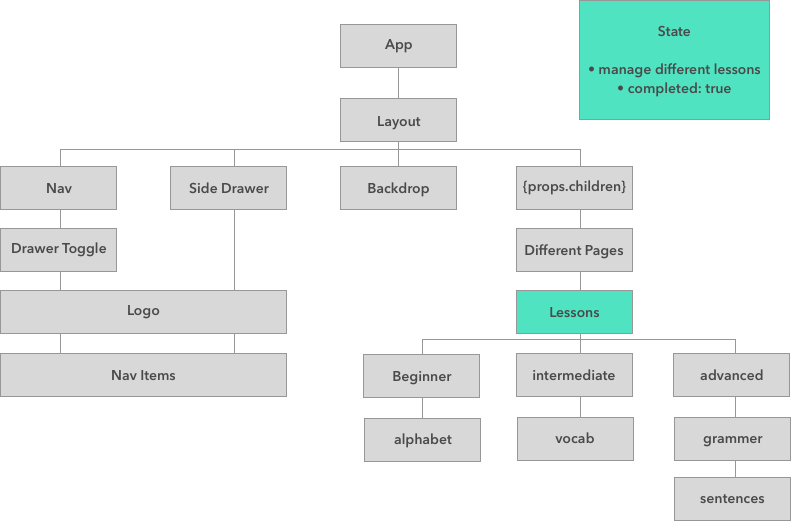
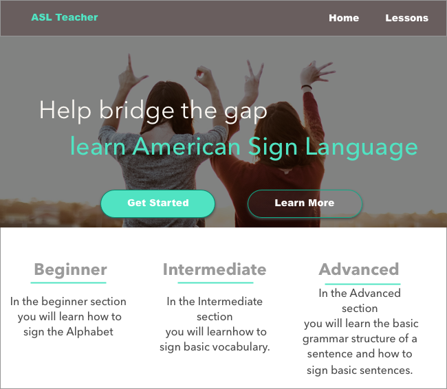
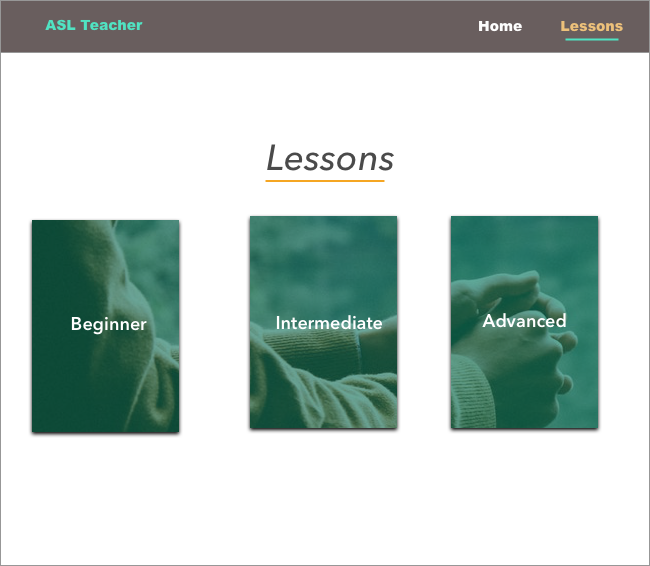

# ASL Teacher
## By: Jamie Pittak
#### Capstone Project for Epicodus

## Description
This webpage will assist user in learning the basic knowledge of American Sign Language in hopes of breaking down the communication barrier between the hearing and deaf communities.

## Project Layout/ Planning

## Setup
1. Clone this repository
2. type npm install in your terminal
3. After npm install is finished, type npm run start
4. navigate to http://localhost:3000/

## Specifications
1. User can select difficulty and choose a desired lesson
2. Once lesson is chosen they will be presented with clickable links that will show them how to sign the specific letter/word or phrase
3. further exploration: user will be able to login and have their progress tracked

## Technologies Used
* Javascript
* JSX
* React
* CSS
* Firebase

## Legal
Copyright &copy; 2018 Jamie Laurelann Pittak
